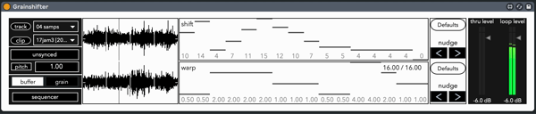
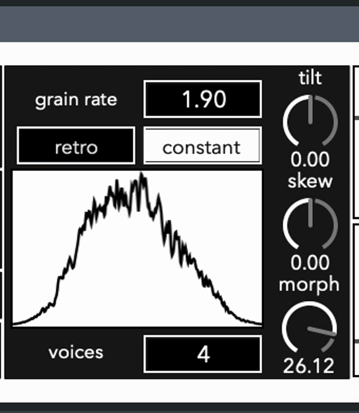
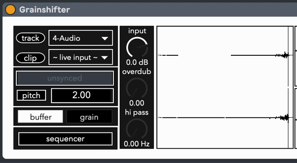

# Grainshifter

### Requires Max 8, Live 9/10

Grainshifter is a granular looper that allows pitch and time to be modified independently of each other, with the ability to shuffle segments of audio and record live input. 

#### Main Concepts

Grainshifter divides audio clips into 16 segments, each with their own *shift* and *warp* settings. *Shift* allows for re-ordering of segments, leading to rhythmic sub-loops and creative rearrangement of pre-recorded audio. *Warp* is the playback speed of that segment, allowing you to speed up or slow down the audio by 2 or 4 times, without affecting the pitch.

Clicking the *sequencer* button will open a secondary window, revealing four sets of *shift* and *warp* control sections, each representing a step in a four stage sequencer. The *shift* and *warp* can sequences can have independent lengths assigned to them, allowing for a 3-step *shift* sequence over a 4-step *warp* sequence, for example.

The *track* and *clip* menus provide access to all tracks and clips shown in session view, allowing you to pull a clip from anywhere in your Live Set. These menus will auto populate when you first add the device, but later changes to the number of clips and tracks will need a manual refresh, which can be done by clicking the *track* and *clip* labels.

*Sync* locks playback to Live's transport. Various settings of *warp* easily allow for clips to become longer than the original audio file, but synced playback will keep things in time with the rest of your live set. Or leave things unsynced for explorations in phasing rhythms and melodies.

*Pitch* is a transposition control for the processed audio, fully independent of playback speed. Clicking the *pitch* label will switch between absolute pitch and semitone adjustments.

A tab-button labeled *buffer* and *grain* swaps between a waveform display of the audio buffer and playhead, and various parameters for grain generation and playback, respectively.

#### Grain Parameters

*grain rate* determines the lifespan of a grain in Hz, extending all the way up to 1000hz for audio rate granulation. Modulation of grain rate occurs two ways: *retro* and *constant*. *retro* behaves like tape or simple sampler playback, introudcing pitch changes as *grain rate* is modified, and likewise *constant* maintains pitch, allowing for expressive modulation of *grain rate* without unstable tonality. Note that in *retro* mode, pitch will gradually return to the value specified by *pitch*, but how fast this happens is dependent upon *grain rate*.

Grainshifter also features a set of precalculated window-functions for grains. Smooth interpolation between the 32 stored windows and the ability to *skew* and *tilt* the contour of the window provide a superb amount of control of grain amplitude and phase relationships, and even timbre changes at audio-rate granulation.

*voices* determines how many grains will be active for playback. Grains are evenly offset by phase from each other within one cycle of the current *grain rate*. Take consideration of voices when used in combination with the other grain parameters, and it becomes possible to stretch and warp most sounds with minimal artifacts, or shape them into entirely new identities.
 
#### Live Input

Selecting "~ live input ~" in the clips menu will reveal 3 additional controls. *Input* is a gain control for boosting or reducing levels recorded into Grainshifter's internal buffer. *Overdub* determines how much of the previous audio remains on the next write cycle. *Hi pass* is a subtle high pass filter for reducing low-end frequency content up to 1000 Hz, useful for pitch shifting live input without muddying the sound.

When live input recording is enabled, *sync* will automatically be enabled, but switcing to a pre-recorded clip will return *sync* to its previous value. 

Currently, the live input buffer will capture one measure of Live's current tempo.
